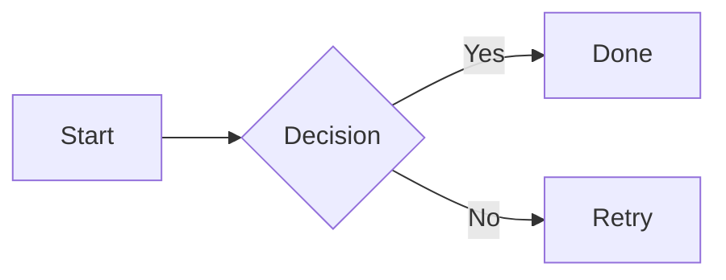

# Nice MD

Nice MD is a lightweight Markdown reader focused on Persian and mixed RTL/LTR technical content.

## Overview

This project provides a clean reading experience for Markdown documentation with:

- Proper RTL-aware layout for Persian text
- Readable code and technical token styling
- Safe and modern Markdown rendering

## Features

- Open local Markdown files
- Drag and drop file support
- In-page search with match count and navigation
- Auto-generated table of contents
- Light and dark themes
- Copy code blocks
- Mermaid diagrams and Chart.js charts
- Reading progress tracking
- Fullscreen mode
- Collapsible sidebar
- Keyboard shortcuts

## Tech Stack

- React
- TypeScript
- `react-markdown`
- `remark-gfm`
- `rehype-sanitize`
- `mermaid`
- `chart.js`

## Diagrams and Charts

Use fenced code blocks with `mermaid` for flowcharts, sequence diagrams, and other Mermaid diagrams:

````markdown

````

Use fenced code blocks with `chart` for data charts (bar, line, pie, doughnut):

````markdown
```chart
{
  "type": "bar",
  "data": {
    "labels": ["Q1", "Q2", "Q3", "Q4"],
    "datasets": [
      {
        "label": "Revenue",
        "data": [12, 19, 8, 15]
      }
    ]
  }
}
```
````

Charts follow the active light/dark theme automatically.

```bash
pnpm install
pnpm dev
```

If `pnpm` is unavailable in your environment, you can use:

```bash
npm install
npm run dev
```

## Keyboard Shortcuts

- `Ctrl/Cmd + O` - Open file
- `Ctrl/Cmd + F` - Open find bar
- `Ctrl/Cmd + R` - Reload current file
- `Ctrl/Cmd + G` - Next search match (when find is open)
- `Ctrl/Cmd + Shift + G` - Previous search match
- `Enter` / `Shift + Enter` - Next / previous match (when find is open)
- `Esc` - Close find bar
- `?` - Show keyboard shortcuts
- `T` - Toggle theme
- `B` - Toggle sidebar
- `F` - Toggle fullscreen

## Notes

- Last opened file metadata is stored locally in the browser.
- Some browsers may ask you to reselect local files after a full refresh.
- Normalization is applied only in memory and does not change original file content.
